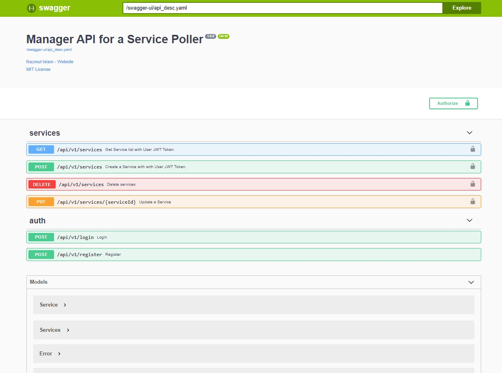
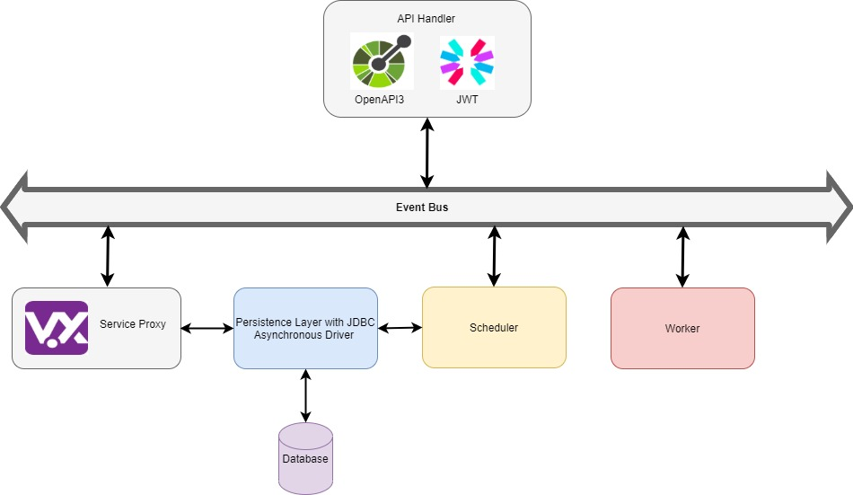

## Guide

- This REST API based project has been built with vertx 3.9.0. Java Runtime Environment 8 is required to run the application as well as to build the application JDK8 is the minimum requirement.

- The purpose of the project is fairly simple, 

>> There are 2 API to registration and login to obtain JWT token.
>> 4 API to create, update delete and get the services
>> Once a service get created only the name of the service can be updated
>> One can not remove services individually but can remove all the services at once
>> After creating the service with a name and a URL, Application will try to polling the state of the service URL and save the status as "OK" or "FAIL"

- API definition can be found with Swagger-UI written in OpenAPI 3.0 specification.

More details about the APIs can be found by visiting the URL from the browser after running the application -

<PROTOCOL>://<HOSTHANME>:<PORT>/swagger-ui

Example : [http://localhost:8080/swagger-ui](http://localhost:8080/swagger-ui)



- High level topology has presented bellow.



- TTD approach is being following during the development, Including unit testing and integration testing 3 different types style is available at test folder.
>> 1. Unit testing with Junit5 jupiter
>> 2. Unit testing with vertx unit testing framework
>> 3. Persistence layer testing with vertx and jdbc driver 

## Properties

Configuration files can be found under conf folder

By default, test_config.json will be picked
~~~
{
  "http.port": 8080,
  "host.name": "0.0.0.0",
  "datasource.url": "jdbc:h2:mem:h2test;MODE=Oracle;DB_CLOSE_DELAY=-1;DATABASE_TO_UPPER=false;",
  "datasource.driver.class.name": "org.h2.Driver",
  "datasource.driver.username": "sa",
  "datasource.driver.password": "",
  "jwk.path": "jwk.json",
  "datasource.schema.setup": true,
  "populate.data.sql": true,
  "poller.status.check.scheduler.time.in.ms": 30000
}
~~~

Other property file can be chosen during gradle run or build by providing profile named followed by -P flag, available profiles are dev, prod, test.

## Prerequisite

You should have following tools installed in your system to run the application

- jdk-1.8.0

- maven 3.6.3 (Optional. Requires, if you don't use mvnw/docker)

- docker (Optional. Requires, if run with docker)

- docker-compose (Optional. Requires, if run with docker-compose)

**Build the application with Gradle**
~~~
./gradlew clean run
~~~
As mentioned earlier additional profile based configuration can be provided with -P parameter.

Example:
~~~
gradlew clean run -Pdev
~~~
**Build the application with Gradle**

It's a gradle based application, To build the application following command need to be run from command line.
~~~
./gradlew clean build
~~~
or
~~~
./gradlew clean build
~~~

Additional profile based configuration can be provided with -P parameter.

**Build the Docker image**

- S1.

To build a docker image with the package, that has been generated at the previous step following command is necessary from command line. Keep in find for this section you will need to build the package at first.
~~~
docker build -t fullstack-code-test-with-vertx .
~~~

- S2.

**[Multi-stage](https://docs.docker.com/develop/develop-images/multistage-build/) Docker build: (Everything using docker)**

It's a great way to ensure builds are 100% reproducible AND as lean as possible. On the downside a Maven build in Docker may have to download many dependencies each time it runs. But RUN’ing the `dependency:go-offline` goal, this will download most* of the dependencies required for the build and cache them for as long as the `pom.xml` **doesn’t change**.

At file DockerfileBuildWIthMavenImage is has been illustrated how to build the package from this project source code with maven docker image and then build the docker image. 
Its pretty helpful if no JDK is installed in the system. Only dependency is docker. Following is the command -

~~~
docker build -t fullstack-code-test-with-vertx -f DockerfileBuildWIthGradleImage .
~~~

**Run the Docker image**

To run the newly created image command is give.  
~~~
docker run -p 8080:8080 fullstack-code-test-with-vertx
~~~
NB: Need to make sure, the port 8080 is free.

Prebuild image is also available at the following URL

[DockerHub/nazmulnaim/fullstack-code-test-with-vertx](https://hub.docker.com/repository/docker/nazmulnaim/fullstack-code-test-with-vertx)

To run the prebuild image -
~~~
docker run -p 8080:8080 nazmulnaim/fullstack-code-test-with-vertx:latest
~~~

or, using docker-compose
```
docker-compose up -d
```
There is also another docker compose file for development purpose.